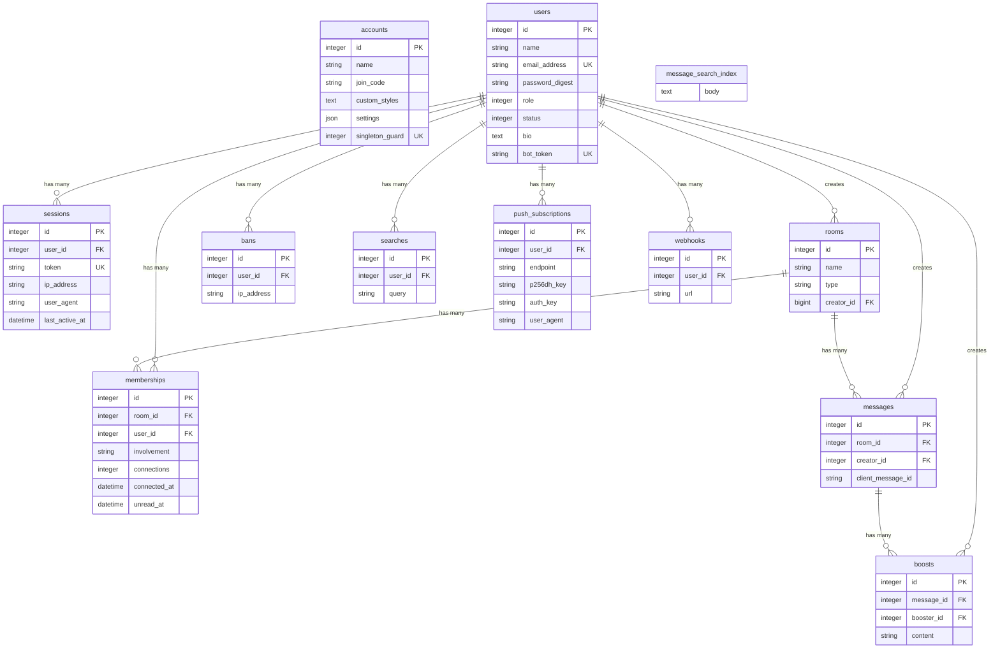

# DB 設計

`db/schema.rb` をもとにしたテーブル構成とリレーションです。

## ER 図

## テーブル説明

### accounts

アプリケーション全体の設定を保持するシングルトンテーブル。
`singleton_guard` カラムにユニーク制約があり、レコードが1件のみであることを保証する。

| 主要カラム | 説明 |
|-----------|------|
| `name` | 組織名 |
| `join_code` | 招待コード |
| `custom_styles` | カスタム CSS |
| `settings` | JSON 形式の設定値 |

### users

ユーザー情報。人間ユーザーと Bot の両方をこのテーブルで管理する。

| 主要カラム | 説明 |
|-----------|------|
| `name` | 表示名 |
| `email_address` | メールアドレス（ユニーク） |
| `password_digest` | `has_secure_password` によるハッシュ |
| `role` | `0`: 一般ユーザー、管理者は別値 |
| `status` | `0`: active, `1`: deactivated, `2`: banned |
| `bot_token` | Bot 用 API トークン（ユニーク） |

### sessions

ログインセッション。トークンベースの認証に使用。

| 主要カラム | 説明 |
|-----------|------|
| `token` | セッショントークン（ユニーク） |
| `ip_address` | ログイン元 IP |
| `user_agent` | ブラウザ情報 |
| `last_active_at` | 最終アクティブ日時 |

### rooms

チャットルーム。STI（単一テーブル継承）で3種類に分かれる。

| `type` 値 | 説明 |
|-----------|------|
| `Rooms::Open` | 全ユーザー参加の公開ルーム |
| `Rooms::Closed` | 招待制の非公開ルーム |
| `Rooms::Direct` | 1対1のダイレクトメッセージ |

### memberships

ユーザーとルームの中間テーブル。

| 主要カラム | 説明 |
|-----------|------|
| `involvement` | 通知レベル（`invisible` / `nothing` / `mentions` / `everything`） |
| `connections` | WebSocket 接続数 |
| `connected_at` | 接続開始日時 |
| `unread_at` | 未読メッセージの日時（nil なら既読） |

インデックス: `(room_id, user_id)` にユニーク制約あり。

### messages

チャットメッセージ。本文は Action Text（`action_text_rich_texts`）で管理される。

| 主要カラム | 説明 |
|-----------|------|
| `client_message_id` | クライアント側で生成する一意 ID |
| `creator_id` | 投稿者（`users.id`） |
| `room_id` | 所属ルーム |

### boosts

メッセージへのリアクション（絵文字）。

| 主要カラム | 説明 |
|-----------|------|
| `content` | 絵文字（最大16文字） |
| `booster_id` | リアクションしたユーザー |
| `message_id` | 対象メッセージ |

### bans

BAN されたユーザーと IP アドレスの記録。

### searches

ユーザーごとの検索履歴。

### push_subscriptions

Web Push 通知用のサブスクリプション情報。

| 主要カラム | 説明 |
|-----------|------|
| `endpoint` | Push サービスのエンドポイント URL |
| `p256dh_key` | 公開鍵 |
| `auth_key` | 認証キー |

### webhooks

Bot ユーザーに紐づく Webhook URL。

### message_search_index

SQLite FTS5 による全文検索用の仮想テーブル。`porter` トークナイザを使用。

## 外部キー制約

| 子テーブル | カラム | 親テーブル |
|-----------|--------|-----------|
| `bans` | `user_id` | `users` |
| `boosts` | `message_id` | `messages` |
| `messages` | `room_id` | `rooms` |
| `messages` | `creator_id` | `users` |
| `push_subscriptions` | `user_id` | `users` |
| `searches` | `user_id` | `users` |
| `sessions` | `user_id` | `users` |
| `webhooks` | `user_id` | `users` |

## Rails 内部テーブル（参考）

以下は Rails フレームワークが管理するテーブルのため、詳細は省略。

- `action_text_rich_texts` — Action Text のリッチテキスト本文
- `active_storage_attachments` — ファイル添付の中間テーブル
- `active_storage_blobs` — アップロードファイルのメタデータ
- `active_storage_variant_records` — 画像バリアント情報
