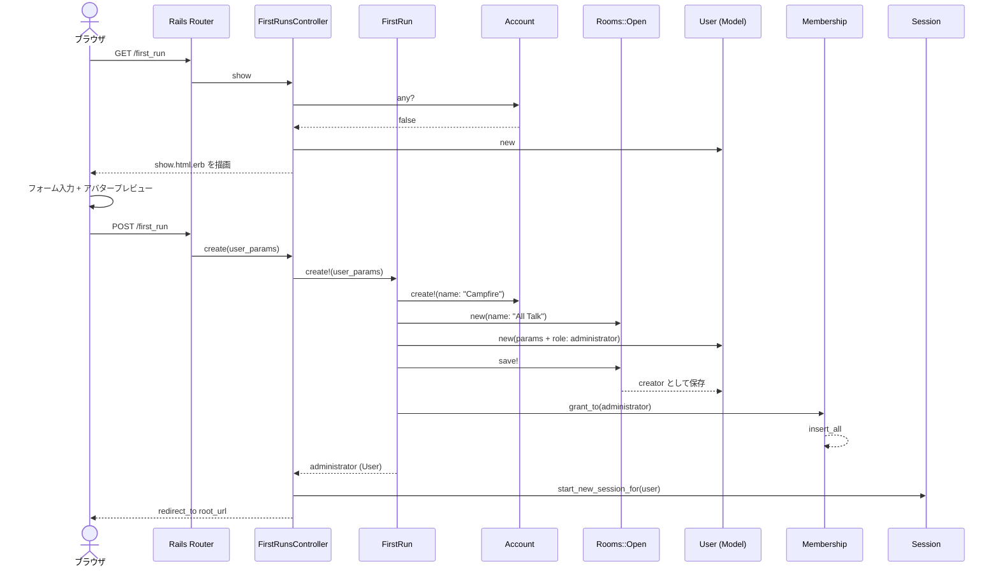

# /first_run リクエストフロー

## 概要

初回セットアップ画面。アプリケーションに Account が存在しない場合のみアクセスでき、管理者ユーザー・Account・最初のルームを一括で作成する。

## ルーティング

```
GET  /first_run → first_runs#show
POST /first_run → first_runs#create
```

`resource :first_run`（単数リソース）で定義されている。

## Controller

`app/controllers/first_runs_controller.rb` — `FirstRunsController`

```
allow_unauthenticated_access          # 認証不要（ログイン前に使う画面）
before_action :prevent_repeats        # Account が既に存在すれば root へリダイレクト
```

### show アクション

- `@user = User.new` で空のユーザーオブジェクトを生成し、フォームに渡す。

### create アクション

1. `FirstRun.create!(user_params)` を呼び出し、管理者ユーザーを作成
2. `start_new_session_for user` でセッションを開始
3. `redirect_to root_url` でトップページへリダイレクト
4. `ActiveRecord::RecordNotUnique` 発生時（二重送信）もトップへリダイレクト

許可パラメータ: `name`, `avatar`, `email_address`, `password`

## Model

### FirstRun（PORO）

`app/models/first_run.rb` — ActiveRecord を継承しないプレーンオブジェクト。

`FirstRun.create!` の処理:

1. `Account.create!(name: "Campfire")` — シングルトンの Account レコードを作成
2. `Rooms::Open.new(name: "All Talk")` — 最初の公開ルームを構築
3. `User.new(user_params.merge(role: :administrator))` — 管理者ユーザーを構築し、ルームの `creator` に設定
4. `room.save!` — ルームとユーザーをまとめて保存
5. `room.memberships.grant_to administrator` — 管理者をルームに参加させる
6. 管理者ユーザーを返却

### Account

- `singleton_guard` のユニーク制約により、1レコードのみ存在可能
- `has_one_attached :logo` でロゴ画像を管理

### User

- `has_secure_password` でパスワードをハッシュ化
- `after_create_commit :grant_membership_to_open_rooms` — 作成後に全公開ルームへ自動参加（初回は "All Talk" のみ）

### Room / Membership

- `memberships.grant_to` は `Membership.insert_all` でメンバーシップを一括挿入
- デフォルトの `involvement` は `"mentions"`

## View

`app/views/first_runs/show.html.erb`

### 画面構成

```
form_with model: @user, url: first_run_path
├── アバターアップロード（upload-preview Stimulus Controller）
│   ├── カメラアイコン + file_field（accept: "image/*"）
│   └── デフォルトアバター画像（プレビュー表示先）
├── 名前入力（text_field, required, autofocus）
├── メールアドレス入力（email_field, required）
├── パスワード入力（password_field, required, maxlength: 72）
└── 送信ボタン
```

- `data-1p-ignore` 属性で 1Password の自動入力を抑制（名前フィールド）
- `autocomplete="username"` / `"new-password"` でブラウザの自動補完を制御

## Stimulus Controller

`app/javascript/controllers/upload_preview_controller.js`

```javascript
// targets: image, input
previewImage() {
  // input の files[0] から ObjectURL を生成し、image の src に設定
  // 画像読み込み完了後に ObjectURL を解放（メモリリーク防止）
}
```

- `file_field` の `change` イベント → `upload-preview#previewImage` アクション
- アバター選択時に即座にプレビューを表示

## Hotwire の動き

この画面では Hotwire の高度な機能（Turbo Frames / Turbo Streams）は使用していない。

- **フォーム送信**: 通常の HTML フォーム送信（POST）
- **ナビゲーション**: Turbo Drive によるページ遷移（デフォルト有効）
- **リダイレクト**: `redirect_to root_url` は Turbo Drive が処理

## シーケンス図


